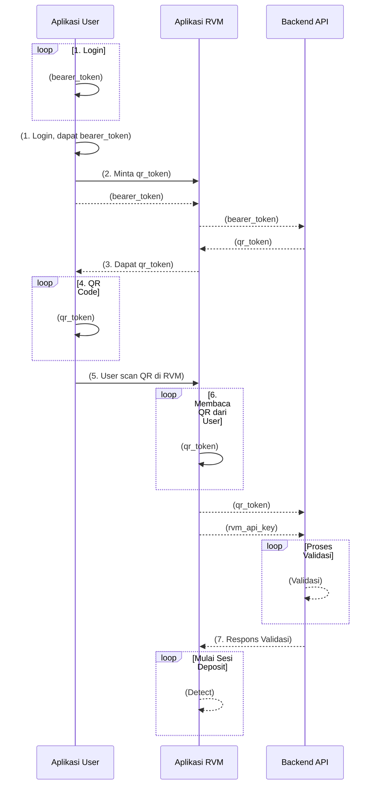

# Alur Singkat "Login" Pengguna di Mesin RVM Fisik

Dokumen ini menjelaskan alur bagaimana seorang pengguna yang terdaftar dapat memulai sesi deposit di mesin RVM fisik. Proses ini tidak melibatkan input kredensial langsung di mesin RVM, melainkan menggunakan QR Code yang di-generate melalui Aplikasi User (Mobile/PWA).

**Istilah Kunci yang Digunakan:**

-   **Backend API:** Sistem pusat berbasis Laravel yang menangani semua logika bisnis dan data.
-   **Aplikasi User:** Aplikasi mobile atau Progressive Web App (PWA) yang digunakan oleh pengguna.
-   **Aplikasi RVM:** Perangkat lunak yang berjalan di mesin RVM fisik (NVIDIA Jetson Orin Nano / Raspberry Pi).
-   **`bearer_token`:** Token dinamis (dihasilkan Laravel Sanctum) yang digunakan untuk otentikasi pengguna saat Aplikasi User berkomunikasi dengan Backend API.
-   **`qr_token`:** Token sementara dan unik yang di-generate oleh Backend API untuk pengguna yang sudah terotentikasi di Aplikasi User. Token ini akan ditampilkan sebagai QR Code.
-   **`rvm_api_key`:** Kunci statis dan rahasia yang unik untuk setiap mesin RVM, digunakan oleh Aplikasi RVM untuk mengotentikasi dirinya ke Backend API.

**Alur Proses:**

1.  **Pengguna Login ke Aplikasi User:**

    -   Pengguna membuka Aplikasi User (Mobile/PWA).
    -   Pengguna melakukan login menggunakan kredensialnya (misalnya, email/password atau Google Sign-In).
    -   Aplikasi User mengirimkan permintaan login ke Backend API.
    -   Backend API memvalidasi kredensial. Jika berhasil, Backend API meng-generate sebuah **`bearer_token`** (menggunakan Laravel Sanctum) dan mengirimkannya kembali ke Aplikasi User.
    -   Aplikasi User menyimpan **`bearer_token`** ini untuk sesi pengguna tersebut.

2.  **Pengguna Meminta untuk Memulai Sesi RVM (Generate QR Code):**

    -   Di dalam Aplikasi User (setelah login), pengguna memilih opsi untuk melakukan deposit sampah di RVM (misalnya, tombol "Gunakan RVM" atau "Setor Sampah").
    -   Aplikasi User mengirimkan permintaan ke Backend API untuk mendapatkan token sesi RVM. Permintaan ini menyertakan **`bearer_token`** pengguna di header `Authorization`.
    -   Backend API menerima permintaan, memvalidasi **`bearer_token`** untuk mengidentifikasi pengguna.
    -   Backend API meng-generate sebuah **`qr_token`** yang unik, sementara, dan terkait dengan `user_id` pengguna tersebut. Token ini memiliki masa berlaku singkat.
    -   Backend API mengirimkan **`qr_token`** ini kembali ke Aplikasi User.

3.  **Aplikasi User Menampilkan QR Code:**

    -   Aplikasi User menerima **`qr_token`** dari Backend API.
    -   Aplikasi User mengubah **`qr_token`** tersebut menjadi gambar QR Code dan menampilkannya di layar perangkat pengguna.

4.  **Pengguna Memindai QR Code di Mesin RVM:**

    -   Pengguna mendekati mesin RVM fisik.
    -   LCD Touchscreen pada RVM menampilkan opsi untuk "Scan QR Code untuk Memulai".
    -   Pengguna mengarahkan QR Code dari Aplikasi User-nya ke kamera mesin RVM.
    -   Aplikasi RVM (berjalan di Jetson/RPi) menangkap dan membaca data dari QR Code, yang berisi **`qr_token`**.

5.  **Aplikasi RVM Memvalidasi Sesi Pengguna ke Backend API:**

    -   Setelah mendapatkan **`qr_token`** dari pemindaian, Aplikasi RVM membuat permintaan ke endpoint khusus di Backend API (misalnya, `/api/rvm/validate-user-token`).
    -   Permintaan ini berisi:
        -   **`qr_token`** yang baru saja dipindai.
        -   **`rvm_api_key`** milik mesin RVM tersebut (dikirim di header HTTP, misalnya `X-RVM-ApiKey`).
    -   Backend API menerima permintaan:
        -   Pertama, memvalidasi **`rvm_api_key`** untuk memastikan permintaan datang dari RVM yang sah dan terdaftar.
        -   Kedua, memvalidasi **`qr_token`**:
            -   Apakah token tersebut ada dan valid?
            -   Apakah token tersebut belum kedaluwarsa?
            -   Token tersebut terkait dengan `user_id` siapa?
    -   Jika kedua validasi (baik `rvm_api_key` maupun `qr_token`) berhasil, Backend API mengirimkan respons sukses ke Aplikasi RVM, yang mungkin berisi informasi dasar pengguna (misalnya, nama depan) untuk ditampilkan di layar RVM sebagai konfirmasi. Backend juga menandai `qr_token` tersebut sebagai sudah digunakan atau memulai sesi untuk user tersebut.

6.  **Sesi Deposit di RVM Dimulai:**

    -   Aplikasi RVM menerima konfirmasi sukses dari Backend API.
    -   LCD Touchscreen pada RVM menampilkan pesan sambutan kepada pengguna (misalnya, "Selamat datang, [Nama Pengguna]! Silakan masukkan item sampah Anda.").
    -   Pengguna sekarang dapat memasukkan item sampah ke dalam RVM untuk diproses. Setiap item yang dimasukkan akan dikaitkan dengan `user_id` yang sudah terverifikasi dalam sesi ini.

7.  **Akhir Sesi:**
    -   Sesi dapat berakhir setelah batas waktu tertentu, setelah sejumlah item dimasukkan, atau jika pengguna memilih untuk mengakhiri sesi melalui RVM (jika ada opsi tersebut).

**Diagram Alur Sederhana (Squence):**

